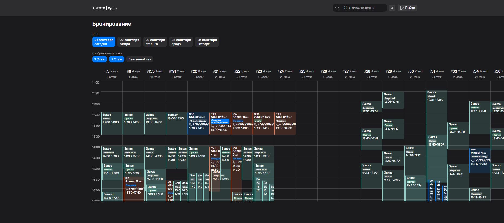

# Restaurant Bookings View

[Демо-версия](https://flowr1x.github.io/restaurant-bookings-view/) | [GitHub](https://github.com/flowr1x/restaurant-bookings-view)

Приложение для управления бронированиями, заказами и очередями в ресторане. Разработано на базе **Vue 3**, с акцентом на удобство использования и гибкость отображения данных.

---

## 📌 Описание

**Restaurant Bookings View** — это современное веб-приложение для эффективного контроля за ресурсами ресторана:

- Бронирование столиков
- Управление заказами и статусами
- Отслеживание очередей
- Визуализация расписания по дням и зонам

Пользователь может легко просматривать все события в виде интерактивной сетки, фильтруя их по датам и зонам (этажам), а также использовать поиск по имени клиента.

---

## 🎯 Основные функции

### ✅ Графическое расписание

- Сетка времени с шагом в 30 минут
- Отображение всех бронирований, заказов и банкетов

### 🔍 Фильтрация и навигация

- Выбор даты: сегодня, завтра, плюс следующие 3 дня
- Фильтрация по зонам: 1 этаж, 2 этаж, Банкетный зал
- Поиск по имени клиента или номеру телефона

### 🌓 Переключение темы

- Поддержка светлой и тёмной темы
- Автоматическое сохранение предпочтений пользователя

### 🧩 Динамическая таблица

- Каждая ячейка соответствует столику и временному слоту
- Информация о количестве мест и номере стола отображается в заголовке
- Возможность быстрого просмотра статуса и контактов клиента

---

## 🖼️ Интерфейс



> На изображении показана таблица с расписанием на 21 сентября. Видны бронирования, заказы и банкеты, распределённые по столикам и временам. Пользователь может переключаться между датами и зонами.

---

## 🛠️ Технологии

- **Vue 3** — основной фреймворк
- **Vite** — сборщик проекта (быстрая разработка и запуск)
- **Pinia** — управление состоянием (опционально, если используется)
- **Local Storage** — сохранение темы и пользовательских настроек

---

## 🚀 Как запустить локально

```bash
git clone https://github.com/flowr1x/restaurant-bookings-view.git
cd restaurant-bookings-view
npm install
npm run dev
```
